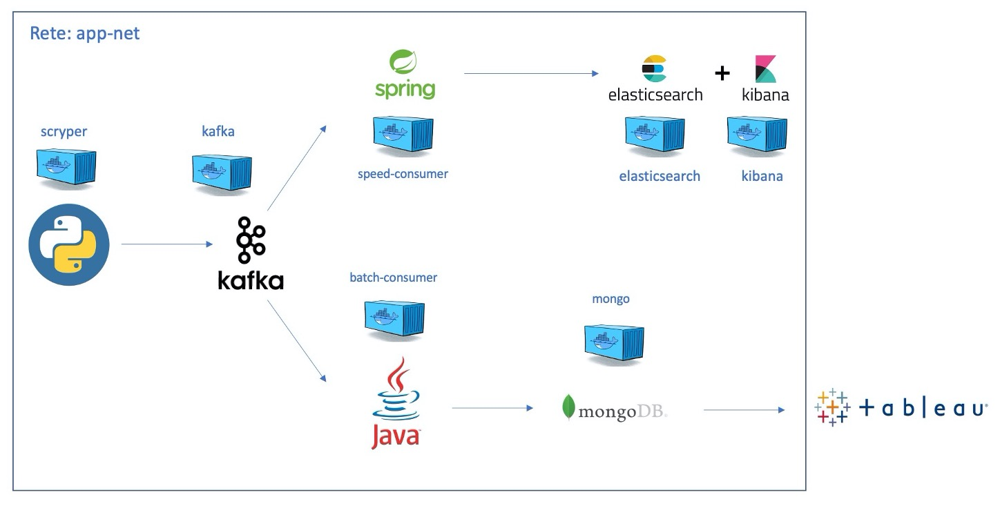

# subreddit-analyzer
A Lambda architecture for analyzing subreddits, both in real-time (dashboard) and in batch (OLAP).
The proposed architecture is shown in the following figure.



## Current progress
- the Python Scryper, which uses PRAW to gather data from Reddit, has been created
- the Speed Layer, which uses Spring+Elastic Search+Kibana, has been created
- the Batch Layer, which uses Java+MongoDB+(Tableau), has been created

## How to run this tool
Move to the main folder of the project, and then run:
```
docker-compose up -d
```
Allow for up to a minute or so for all the services to be ready. After that, some additional configuration is required:

## Speed Layer
- Go to http://localhost:5601 (kibana).
- First import data with correct datetime zone
    - Go to left option bar > Stack Management > Advanced Settings > Timezone for date formatting > Set to Defaut (browser) > Reload page and check on discover sidebar menu that data is available. 
    - Go to left option bar > Stack Management > Advanced Settings > Timezone for date formatting > Set to UTC.
- For importing kibana objects:
    - Go to left option bar > Stack Management > Advanced Settings > Saved Objects > Import file
- For visualizing the imported kibana dashboard:
    - Go to left option bar > Dashboard > Select imported dashboard to start visualizing real-time data.
    - If the data doesn't appear check the selected dates in the upper-right corner of the Kibana dahboard
        - **Note**: Date errors may occur before or after changing timezones, dependending on the browser default settings. If an error occurs in the dashboard ("Impossible to convert Browser datetime zone" or stuff like that), or if dates are shifted by 1h, go to advanced settings and change the datetime zone as it was before.   
    
## Batch Layer
- Download the MongoDB BI Connector at https://docs.mongodb.com/bi-connector/v2.0/installation/
- Run the following commands:
```
mongodrdl --host localhost -d reddit_data -o schema.drdl
mongosqld --schema schema.drdl --mongo-uri localhost
```
- Open Tableau and connect to localhost:3307, you can now use data from reddit_data to do some OLAP.
